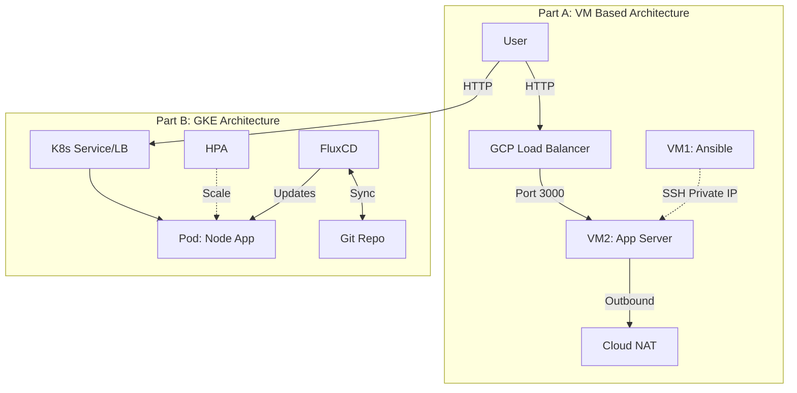
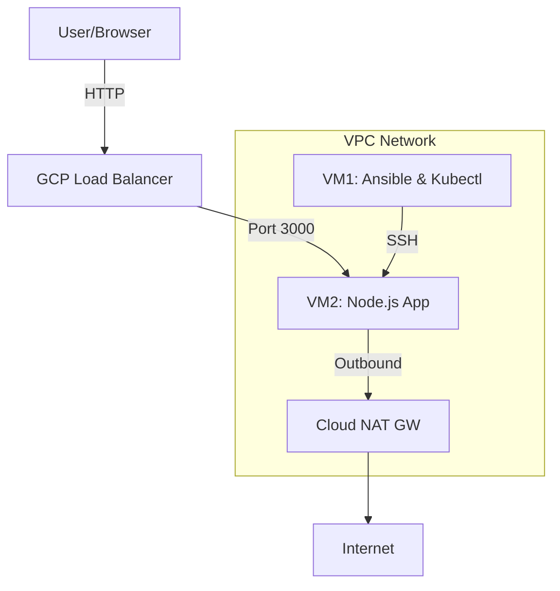

# DevOps Technical Test - Hybrid Deployment

This project implements a hybrid deployment strategy for a DevOps technical test, covering both traditional deployment using Ansible/PM2 on VMs and modern containerized deployment using Docker/GKE with FluxCD GitOps.

## 🏗 Project Structure

```text
.
├── .github/workflows/      # CI Pipeline (VM & Container)
├── ansible/                # Part A - Ansible & PM2 Configuration
│   ├── roles/              # Ansible Roles (runtime & app)
│   ├── playbooks/          # Main Deployment Playbook
│   ├── inventory.ini       # Target Server Inventory
│   └── ansible.cfg         # Ansible Configuration
├── app/                    # Sample Node.js Express Application
│   ├── Dockerfile          # Container Definition
│   └── index.js            # Main Logic
├── charts/node-app/        # Part B - Helm Chart for Kubernetes
└── flux/                   # Part B - FluxCD GitOps Manifests
```

## 📐 Hybrid Architecture Overview



## 🚀 Part A: Traditional Deployment (VM-Based)

### A1 - Architecture
The infrastructure consists of two Google Compute Engine (GCE) VMs in `asia-southeast2-a` default subnet:

| Component | Description | Network |
|-----------|-------------|---------|
| **VM1** | Ansible Server + Kubectl Client | Public IP (EIP) |
| **VM2** | Application Server (Node.js) | Private IP Only |

**Connectivity:**
- **VM1 -> VM2**: SSH connection via Private IP.
- **VM2 -> Internet**: Outbound traffic routed through Cloud NAT Gateway.
- **Internet -> VM2**: Inbound traffic managed by GCP Load Balancer.

**Diagram:**


### A2 - Automation & Runtime
- **Tools**: Ansible for configuration management.
- **Roles**: 
  - `runtime`: Installs Node.js 20, PM2, and configures `pm2 startup` for boot persistence.
  - `app`: Clones repository and starts application.
- **Verification**: Application auto-starts after VM reboot via systemd.

### A3 - CI/CD Workflow
- **Trigger**: Commit message contains `deploy_vm` or `deploy_all`.
- **Pipeline**: GitHub Actions SSHs into VM1 -> VM1 runs Ansible Playbook -> Deploys to VM2.
- **Access**: App available at `http://34.128.87.170/`.

---

## ☸️ Part B: Containerization & Kubernetes (GKE)

### B1 - Dockerization
- **Dockerfile**: Located in `./app/Dockerfile`.
- **Build**: Use simple node base image.

### B2 - CI/CD Pipeline
- **Trigger**: Commit message contains `build` or `deploy_all`.
- **Flow**:
  1. **Source**: GitHub Actions triggers on push.
  2. **Build**: Builds Docker image and tags with `github.sha`.
  3. **Push**: Pushes image to Docker Hub.
  4. **Deploy**: FluxCD detects new image -> updates Git config -> Syncs GKE.

### B3 - Deployment Strategy
The application is deployed using two distinct methods for demonstration:

1. **Helm Release**:
   - Managed via FluxCD HelmController.
   - **URL**: `http://34.96.120.171`
   
2. **Raw Manifests**:
   - Standard Kubernetes `Deployment` and `Service` YAMLs.
   - **URL**: `http://34.110.159.92`

**Scaling (HPA):**
- Horizontal Pod Autoscaler configured based on CPU and Memory usage.

---

## 📊 Part C: Visibility & Monitoring

Centralized monitoring stack using Prometheus and Grafana.

**Access:**
- **Dashboard URL**: [Grafana Dashboard](http://34.101.189.60/d/monitoring-apps-helm-and-raw/apps-monitoring-devops-test?orgId=1&from=now-1h&to=now&timezone=browser&var-datasource=prometheus&var-namespace=$__all&var-pod=$__all&refresh=10s)
- **Credentials**: `admin` / `devops-test-pena`
- **Sample monitoring dashboard**: 


**Key Metrics Monitored:**
- CPU Usage
- Memory Usage
- Pod Status/Availability
- Requests Per Second (RPS)
